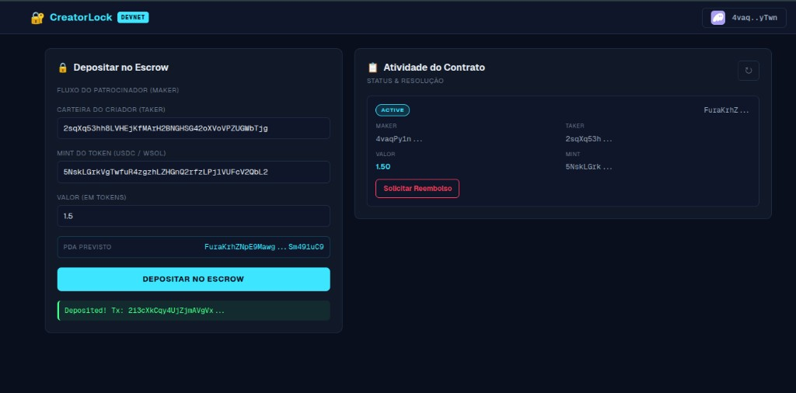

# 🦎 CreatorLock — SPL escrow for creators

[](https://www.anchor-lang.com/)
[](https://explorer.solana.com/address/3XBXCwwN5CMGhjnV1CD94exPqPY4mL2LPifdzaowGmhw?cluster=devnet)
[](https://nextjs.org/)
[](LICENSE)

**CreatorLock** is a minimal, trustless escrow on Solana for creator–sponsor deals: the **maker** (sponsor) locks SPL tokens in a PDA-backed vault; the **taker** (creator) **releases** them after delivery, or the maker **cancels** and gets a full refund. Built with **Anchor 0.32.1** following the **solana-vault-standard** pattern, with an **Adversarial Battle Test Suite** that proves security under attack. Includes a **Next.js 16** + **Tailwind CSS 4** app with a dark IDE-style UI.

---

## 🇧🇷 Português — Superteam Brasil x NearX · Desafio 1

> Submissão para o **Desafio 1 — Escrow com Anchor** do Bootcamp Hackathon Global 2026.

### O que o programa faz

**CreatorLock** é um escrow condicional de tokens SPL na Solana. O **maker** (patrocinador) deposita tokens num vault controlado por uma PDA. O **taker** (criador) libera os fundos após entregar o trabalho — ou o maker cancela e recupera tudo. Nenhum intermediário, nenhuma taxa além do rent da Solana.

### Instruções disponíveis

| Instrução | Quem assina | O que faz |
| --------- | ----------- | --------- |
| `initialize_and_deposit(amount)` | Maker | Cria `EscrowState` + vault token account (PDA); transfere `amount` do ATA do maker → vault |
| `release()` | Taker | Transfere vault → ATA do taker; fecha vault e escrow; devolve rent ao maker |
| `cancel_and_refund()` | Maker | Transfere vault → ATA do maker; fecha vault e escrow; devolve rent ao maker |

**PDAs utilizadas:**
- `EscrowState` → seeds: `["escrow", maker]`
- `vault` → seeds: `["vault", escrow_state]`
- Bumps canônicos armazenados on-chain (`bump`, `vault_bump`) — sem recalcular a cada chamada

### Como rodar os testes

```bash
# 1. Instalar dependências
yarn install

# 2. Build do programa
anchor build

# 3. Rodar a suite de testes (sobe validador local automaticamente)
anchor test
```

Resultado esperado: **11 testes passando** — happy path, cancel path, controle de acesso e 4 testes adversariais (Battle Suite).

### Program ID (Devnet)

```
3XBXCwwN5CMGhjnV1CD94exPqPY4mL2LPifdzaowGmhw
```

[Ver no Solana Explorer →](https://explorer.solana.com/address/3XBXCwwN5CMGhjnV1CD94exPqPY4mL2LPifdzaowGmhw?cluster=devnet)

---

## 💡 The Problem

The creator economy runs on trust — and trust breaks. Sponsors pay upfront and creators disappear. Creators deliver and sponsors ghost. There is no neutral party on the internet that both sides can trust without a cut.

**CreatorLock** puts the escrow on-chain. No intermediary. No fees beyond Solana rent. The rules are the program — and the program is open source.

| Role | What they do |
| ---- | ------------ |
| **Maker** (sponsor) | Locks SPL tokens in a PDA vault. Funds are provably inaccessible until resolution. |
| **Taker** (creator) | Delivers the work, then calls `release()` to collect. |
| **Either** | If the deal falls through, the maker calls `cancel_and_refund()` and gets everything back. |

---

## 🖥️ Live Demo

**Program deployed on Devnet:**
[`3XBXCwwN5CMGhjnV1CD94exPqPY4mL2LPifdzaowGmhw`](https://explorer.solana.com/address/3XBXCwwN5CMGhjnV1CD94exPqPY4mL2LPifdzaowGmhw?cluster=devnet)



The screenshot above shows a live devnet transaction: maker deposited 1.5 tokens into escrow, the on-chain `EscrowState` appeared in the Activity panel with status **ACTIVE**, and the "Solicitar Reembolso" action became available immediately.

**Deposit transaction (devnet):**
[`2i3cXkCqy4UjZjmAVgVx2N4ShqEmQyCBR1b8cn4C8K1Ez641abo9UtwZiYtwuszXZYi4eZken9e4XrridG9QFRKn`](https://explorer.solana.com/tx/2i3cXkCqy4UjZjmAVgVx2N4ShqEmQyCBR1b8cn4C8K1Ez641abo9UtwZiYtwuszXZYi4eZken9e4XrridG9QFRKn?cluster=devnet)

---

## 🔥 Highlights

- **solana-vault-standard** — vault is a PDA token account at `["vault", escrow_state]`; all outbound transfers are PDA-signed CPIs using stored canonical bumps  
- **Three instructions** — `initialize_and_deposit`, `release`, `cancel_and_refund` with SPL token CPIs  
- **Deterministic PDAs** — `EscrowState` at `["escrow", maker]`, vault at `["vault", escrow_state]`  
- **Canonical bumps** stored on-chain (`bump`, `vault_bump`) — no bump recalculation each call  
- **Anchor account constraints** — `seeds`, `bump`, `has_one`, `close = maker` for rent recovery  
- **Guardrails** — `require!(amount > 0)`, custom errors for wrong taker / maker / mint  
- **11 integration tests** — happy path, cancel path, access control, and a **4-test Adversarial Battle Suite**  

---

## 🌟 What’s on-chain

| Instruction | Signer | What it does |
| ----------- | ------ | -------------- |
| **`initialize_and_deposit(amount)`** | Maker | Creates `EscrowState` + vault token account; transfers `amount` from maker ATA → vault |
| **`release()`** | Taker | Transfers vault → taker ATA; closes vault + escrow; **rent to maker** |
| **`cancel_and_refund()`** | Maker | Transfers vault → maker ATA; closes vault + escrow; **rent to maker** |

On-chain state (`EscrowState`): `maker`, `taker`, `token_mint`, `amount`, `bump`, `vault_bump`.

---

## 🧩 Stack

| Layer | Choice |
| ----- | ------ |
| On-chain | [Anchor](https://www.anchor-lang.com/) 0.32.1, `anchor-lang` + `anchor-spl` (token) |
| Language | Rust (edition 2021) |
| Tests | [ts-mocha](https://github.com/piotrwitek/ts-mocha), Chai, `@coral-xyz/anchor`, `@solana/spl-token` |
| Frontend | Next.js 16, React 19, Tailwind 4, Solana wallet adapter + `@solana/web3.js` |

---

## 🛠️ Prerequisites

- **Rust** (stable) and **Solana CLI** — [Anza install](https://github.com/anza-xyz/agave/wiki/Agave-Validator-Install)  
- **Anchor** — via `avm` (recommended): `cargo install --git https://github.com/coral-xyz/anchor avm --locked` then `avm install 0.32.1 && avm use 0.32.1`  
- **Node.js** ≥ 20 and **Yarn** 1.x (repo uses `yarn` for the root test script)  

---

## 🚀 Quickstart (clone → install → build → test)

### 1. Clone

```bash
git clone <your-repo-url>.git
cd gecko-creator-lock
```

### 2. Install JS dependencies (repository root)

```bash
yarn install
```

### 3. Build the program

```bash
anchor build
```

### 4. Run tests (local validator)

```bash
anchor test
```

Expected summary (timings vary):

```
  CreatorLock — Escrow Program
    Happy Path: Initialize → Release
      ✔ initializes the escrow and deposits tokens into the vault
      ✔ releases funds from vault to taker and closes accounts
    Cancel Path: Initialize → Cancel & Refund
      ✔ initializes escrow for cancel test
      ✔ cancels escrow and refunds tokens to maker
    Security: Access Control
      ✔ rejects release when called by an intruder (not the taker)
      ✔ rejects cancel when called by someone other than the maker
      ✔ rejects zero-amount deposit
    Battle Tests: Adversarial Patterns
      ✔ BT-1a: attacker cannot release funds — has_one = taker rejects wrong signer
      ✔ BT-1b: attacker cannot cancel a foreign escrow — PDA seeds mismatch
      ✔ BT-2: spoofed vault (attacker ATA) is rejected by seeds constraint
      ✔ BT-3: raw SPL transfer from vault is blocked — vault authority is the PDA

  11 passing (14s)
```

---

## 🔑 Program ID

The codebase is wired to this program id everywhere (`declare_id!`, `Anchor.toml`, `app/src/lib/idl.ts`):

```
3XBXCwwN5CMGhjnV1CD94exPqPY4mL2LPifdzaowGmhw
```

After you **deploy your own** build to devnet or mainnet, replace it in:

- `programs/creator-lock/src/lib.rs` (`declare_id!`)  
- `Anchor.toml` → `[programs.devnet]` / `[programs.mainnet]` (add block if needed)  
- `app/src/lib/idl.ts` → `PROGRAM_ID` and embedded `IDL.address`  

Then run `anchor build` and refresh the IDL in the app if you regenerate types.

---

## 🌍 Deploy (Devnet)

```bash
solana config set --url devnet
solana airdrop 2   # if needed

anchor deploy --provider.cluster devnet
```

Use a dedicated funded key in `~/.config/solana/id.json` (or `ANCHOR_WALLET`). **Do not** deploy to mainnet without review and an explicit decision.

---

## 💻 Frontend (Next.js app)

From the repo root:

```bash
# Install all dependencies (root + app share the same yarn.lock)
yarn install

# Start the dev server
cd app
yarn dev
```

Open [http://localhost:3000](http://localhost:3000). Use a wallet on the **same cluster** as your RPC (e.g. Devnet).

| Area | Role |
| ---- | ---- |
| **Maker panel** | Deposit form: taker pubkey, mint, amount; live **escrow PDA** preview |
| **Activity panel** | Lists escrows for the connected wallet; **Release** when you are the taker; **Cancel** when you are the maker |

Styling: dark IDE theme (`app/src/app/globals.css`).

---

## 📁 Repository layout

```
gecko-creator-lock/
├── Anchor.toml                    # toolchain, provider, program ids, test script
├── Cargo.toml                    # Rust workspace
├── package.json                  # root: anchor test deps + ts-mocha
├── programs/
│   └── creator-lock/
│       ├── Cargo.toml
│       └── src/lib.rs            # all instructions + accounts + errors
├── tests/
│   └── creator_lock.ts           # integration tests
├── target/types/                 # generated client types (after anchor build)
└── app/                          # Next.js frontend
    ├── package.json
    └── src/
        ├── app/                  # layout, page, global styles
        ├── components/           # WalletProvider, MakerPanel, TakerPanel
        └── lib/idl.ts            # PROGRAM_ID + IDL for the browser
```

---

## 🧪 Flow (ASCII)

```
Maker (sponsor)                    Solana program                    Taker (creator)
      │                                   │                                  │
      ├─ initialize_and_deposit ─────────►│ EscrowState PDA + vault          │
      │                                   │ SPL transfer → vault              │
      │                                   │                                  │
      │                                   │◄──────── release() ──────────────┤
      │◄── vault rent (on close) ─────────┤ SPL → taker; close accounts       │
      │                                   │                                  │
      │         — or —                    │                                  │
      │                                   │                                  │
      ├─ cancel_and_refund ──────────────►│ SPL → maker; close accounts       │
      │◄── token refund + rent ───────────┤                                  │
```

---

## 🔒 Security

- This repository is suitable for **learning and hackathon demos** — not a substitute for a **professional audit** before high-value or mainnet use.  
- Review **PDA seeds**, **signer roles**, and **mint / ATA** alignment for any fork or UI change.  
- Use a **deployment-only** key; never commit private keys or real `.env` secrets.  

---

## 🤝 Contributing

1. Branch: `git checkout -b feat/<scope>-<description>-<DD-MM-YYYY>`  
2. `anchor build && anchor test`  
3. For program edits: `cargo fmt` and `cargo clippy` as in your team checklist  
4. PR with a short description of behavior changes  

---

## 📄 License

**MIT** — see [LICENSE](LICENSE) if present in the repo.

---

## 🔗 Useful links

- [Anchor book](https://book.anchor-lang.com/)  
- [Solana docs](https://docs.solana.com/)  
- [SPL Token](https://spl.solana.com/token)  

**Gecko / CreatorLock · escrow for the creator economy on Solana**
